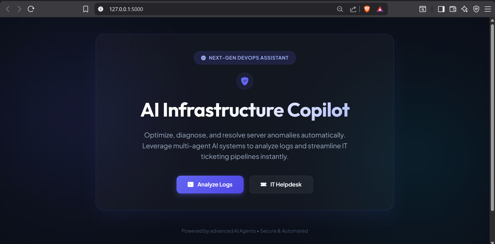
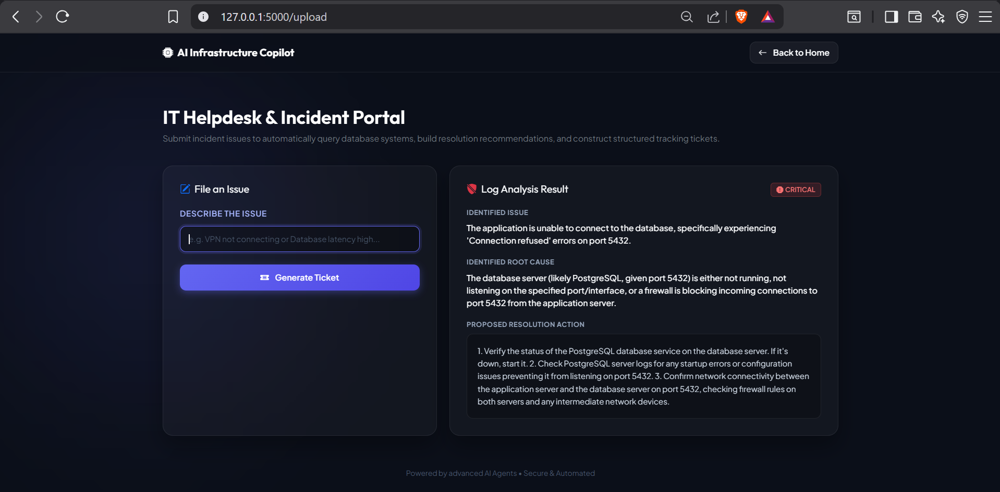
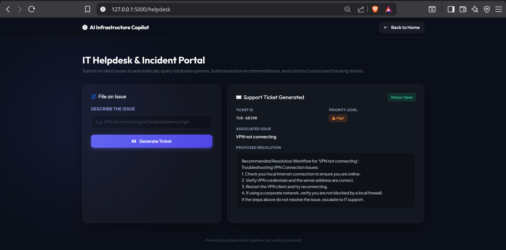

# 🚀 AI Infrastructure Copilot

> AI-powered Infrastructure Monitoring & IT Helpdesk Automation Platform built using Flask, Gemini AI, and SQLite.


---

## 📌 Overview

AI Infrastructure Copilot is an intelligent DevOps assistant that automates infrastructure log analysis and IT helpdesk workflows using a multi-agent AI architecture.

The platform analyzes infrastructure logs, identifies incidents, determines severity, recommends resolutions, and automatically generates IT support tickets while storing all incidents in a SQLite database.

---

## ✨ Features

- 🔍 AI-powered Log Analysis
- 🤖 Multi-Agent Workflow
- 🚨 Incident Detection
- 📊 Severity Classification
- 📝 Automatic Ticket Generation
- 💾 SQLite Database Integration
- 🌐 Flask Web Application
- 🎨 Modern Responsive UI

---

## 🏗 Project Architecture

```
                User
                  │
                  ▼
          Flask Web Application
          ┌─────────┴─────────┐
          ▼                   ▼
     Log Analysis Agent   Helpdesk Agent
          │                   │
          └─────────┬─────────┘
                    ▼
              Gemini AI API
                    │
                    ▼
            SQLite Database
                    │
                    ▼
             Dashboard (Upcoming)
```

---

## 🛠 Tech Stack

- Python
- Flask
- Google Gemini API
- SQLite
- HTML5
- CSS3
- Bootstrap
- Git
- GitHub

---

## 📂 Project Structure

```
AI-Infrastructure-Copilot
│
├── agents
│   ├── log_agent.py
│   └── helpdesk_agents.py
│
├── database
│   ├── db.py
│   └── copilot.db
│
├── templates
│   ├── home.html
│   ├── upload.html
│   └── helpdesk.html
│
├── app.py
├── requirements.txt
└── test_log_analysis.py
```

---

## ⚙️ Installation

Clone the repository

```bash
git clone https://github.com/ParthoRoy07/AI-Infrastructure-Copilot.git
```

Go to project folder

```bash
cd AI-Infrastructure-Copilot
```

Install dependencies

```bash
pip install -r requirements.txt
```

Run the application

```bash
python app.py
```

Open:

```
http://127.0.0.1:5000
```

---

## 📸 Screenshots

### 🏠 Home Page



---

### 📊 Log Analysis



---

### 🎫 Helpdesk Portal


### Dashboard (Coming Soon)

---

## 🚀 Future Improvements

- Admin Dashboard
- Live Monitoring
- Email Notifications
- Grafana Integration
- Docker Support
- Kubernetes Deployment
- Cloud Deployment
- Authentication & Role Management

---

## 👨‍💻 Author

**Partho Roy**

- GitHub: https://github.com/ParthoRoy07
- LinkedIn: https://www.linkedin.com/in/partho-roy-kiit/)

---

⭐ If you like this project, consider giving it a star!
